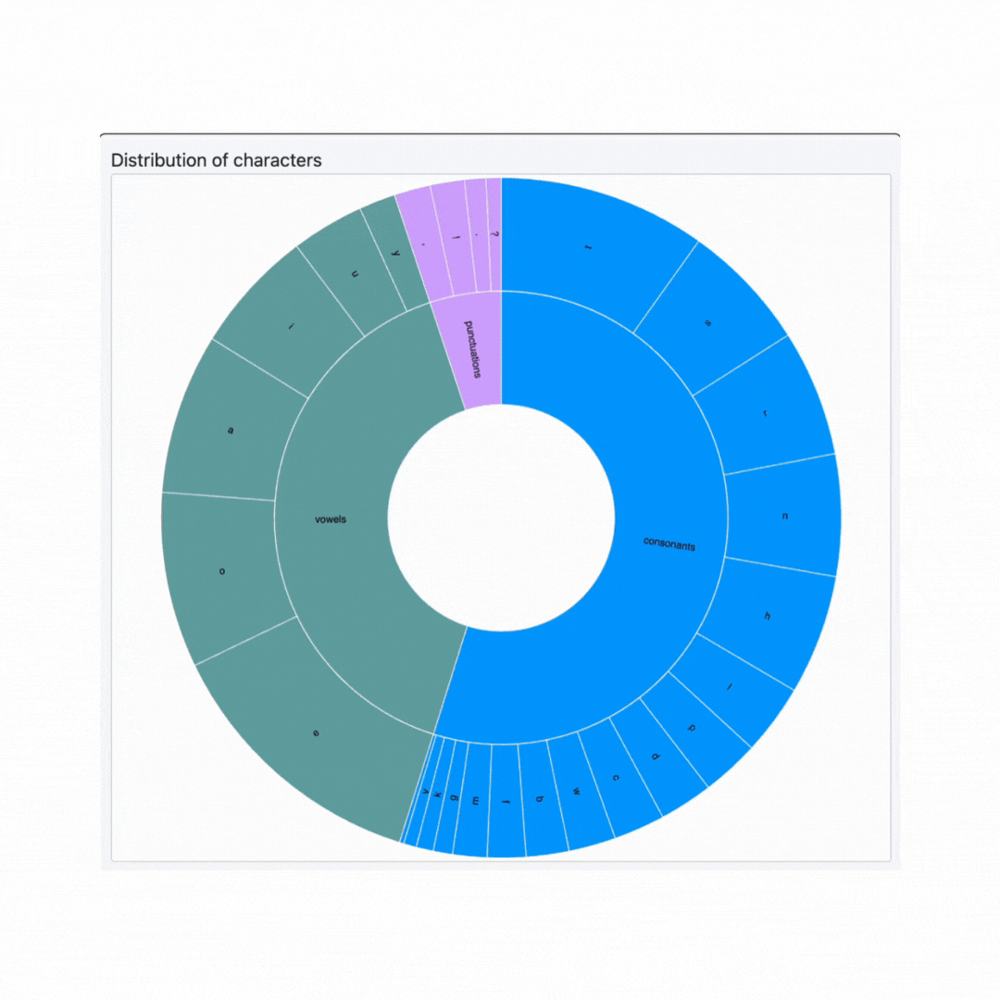

# Extra credit assignment: Linking Charts and Adding Interactivity

The goal of this homework is to give you practice building and linking more complex visualizations together in D3. By the end of this assignment you should be able to:

- Dynamically create and parse a string dataset in JavaScript
- Visualize a hierarchical dataset in a sunburst chart and a flow dataset in a Sankey diagram
- Dynamically update charts based on user interactions
- Add an interactive tooltip

The screenshot below shows an example of what your finished interface will look like.


## Overview

The starter code for this assignment shows three panels on the `index.html` page. The top panel contains a `textarea` html element and a `submit` button. The user can enter a set of text and then click the button. This should create a sunburst chart in the bottom-left panel. The sunburst chart will have two layers. The first layer will have the arcs labeled "vowels","punctuations", and "consonants". And the second layer will visualize the distribution of the entered text characters based on how many times they appear in the `textarea` (i.e., each arc will be sized based on the count of that character; a larger arc will indicate that character appears more often) and also we will visualize under which category they fall into (i.e., vowels, consonants, and punctuations). The sunburst chart will be hierarchical: consonants will be one color (and grouped together), vowels another color (grouped together), and punctuation characters a third color (grouped together).

Clicking a arc for a character (in the screenshot above, the `p` arc has been clicked) will create a Sankey diagram in the bottom-right panel. In the Sankey, the left column show chracters in the `textarea` that are immediately prior to the selected character (e.g., `lp`, `mp`, `np`, etc.) and the right column characters immediately after the selected character (`pm`, `pd`, `pb`, etc.). The middle column will be the selected character. All nodes in the Sankey diagram will be sized based on their count (e.g., for the left column, how often `lp` occurs, how often `mp` occurs, etc.).

## Data Description

The text entered into the `textarea` element will consitute the dataset for your visualizations. You should assume that the entered characters will be of the following types.

- consonants (`bcdfghjklmnpqrstvwxz`)
- vowels (`aeiouy`): for the purposes of this assignment, the letter `y` should always be considered a vowel
- punctuation (`.,!?:;`): period, comma, question mark, exclamation mark, colon, and semi-colon are required, though you may support additional characters if desired

You may ignore other characters, including spaces, line breaks, tabs, and other symbols like $, @, ", etc.
As an example, if the user submits the following as their text:

```html
 Lorem Ipsum Dolor Sit Amet! Consectetur Adipiscing elit?
```

You would count the number of times each vowel appears in the submitted text:

```
a: 2, e: 5, i: 6, o: 4, u: 2, y: 0
```

Note that I'm storing the vowels in a case-insensitive manner; you should also do this! Count and store the vowels, consonants (also case-insensitive), and punctuation characters  into a hierarchical data structure that is appropriate for a sunburst visualization.

The arcs in the treemap will be sized based on the count of the character (i.e., a bigger arc indicates that character appears more often), and organized based on its vowel/consonant/punctuation grouping. You may design your own categorical colormap to indicate these groups, or use a pre-defined D3 colormap. Add a small spacing/padding between the arcs, similar to what is shown in the screenshots. When you hover on an arc in the sunburst chart, display a tooltip indicating the character name and its count (see below GIF). The tooltip should smoothly follow the mouse cursor, and disapper when

 When the user clicks on an arc, you'll create a Sankey chart in the third panel. This Sankey chart will have three columns: the middle column will show the currently selected character, the left column will show the characters that appear in the `textarea` immediately before the selected character (with the rectangles sized based on how often this happens), and the right column will show characters that occur immediately afterwards (likewise sized). You'll need to create another dataset for this chart (i.e., one that shows which characters are found immeidately before the selected character, and how often they occur, and characters that appear after the selected character).

You can consider testing using random text generators, such as [https://loremipsum.io/generator](https://loremipsum.io/generator) when working on your page.

## To complete the assignment

- Clone this code template to your local machine.
- Start a local server and open the `index.html` page.
- Modify the given code according to the instructions below to achieve the requested interface.
- Commit and push the code back to this repository to submit it.

## Step 0: Starting code

When you first run the page, you should see the empty interface. Add your name and email to the top, and then create a Javascript file to contain all your JS/D3 logic. You should name the file using your ASURITE. For example, Dr. Bryan's JS file would be named `cbryan16.js`. Link to this file in your index.html.

## Step 1: Displaying a Sunburst chart

When the page first loads, all three panels should be blank.
When the user enters a set of text in the top panel and then clicks on the `Submit` button, you should display a sunburst chart that shows the distrubution of grammar characters from the `textarea` (i.e., the vowel counts, the consonant counts, and the punctuation counts in the entered text).

- You'll want to first read the entered text from the `textarea` and store it in a set of one or more data structures. Every time the submit button is pressed, you'll need to clear and recreate these (and re-display the sunburst chart).
- Your sunburst chart should be centered inside the `#sunburst_div` svg. You may choose the margin around the chart, but make it doesn't go outside of the `svg`'s bounds, and that it's not too small.
- Choose a categorical d3 color scale for this chart by picking a color scale from [https://github.com/d3/d3-scale-chromatic](https://github.com/d3/d3-scale-chromatic) or creating your own manual one. All vowels will be one color, consonants another, and puncutations a third.
- Similar to what's shown in the sunburst chart, the arcs in each group should be organized together (e.g., all vowels together). There are various ways to create these hierarchies; for my code, I used this [Sunburst tutorial](https://observablehq.com/@d3/zoomable-sunburst) as a reference.
- Add a small padding/margin between the arcs.

| 🔍 **Hint:** Make sure your dataset is in the correct form when creating the sunburst chart. The Sunburst tutorial shows a correct hierarchical/nested dataset that is suitable for the sunburst chart.



## Step 2: Displaying a Sankey chart

When the user clicks on a character arc in the sunburst chart, draw a Sankey diagram in the bottom right panel. Your design should look similar to what is in the screenshots. The chart should be centered in the panel (with reasonable margins, similar to the screenshots), with nodes sized based on the counts of each character.

- The node rectangles in the Sankey diagram should be the same colors as the rectangles in the treemap. In my screenshots, I put a bit of spacing/padding between the rectangles (i.e., vertical spacing between the rectangles in the left column), and added a small rounding to the rectangles. You should give the bars a 1 pixel thick black border.
- If the user clicks on a different arc in the treemap, re-load the Sankey diagram for the selected character. When you do this, you'll need to build an appropriate dataset: the left column will show the counts of characters that occur immediately before that character (e.g., in the top screenshot on this page, `p` is selected, and the left column shows `ep`, `op`, etc.). The middle column sizes the `p` character based on the number of times it appears in the submitted text, and the right column shows characters immediately after `p` (e.g., `po`, `pa`, etc.). The ordering for nodes in the left/right columns is up to you (I'm using the ordering outputted by D3's `sankey` library).
- If the user clicks the `submit` text button in the top panel (thus submitting a new set of text, and re-loading the sunburst chart), clear the Sankey diagram (make this a blank panel).
- You should also update the text at the top of this panel whenever a Sankey chart is loaded/cleared. When no chart is shown, the text should say `Character flow for ...`. When a character is selected, it should say `Character flow for 'char'`, where `char` is the selected character.

| 🔍 **Hint:** D3 does not contain a `sankey` function in its base library, so you'll need to import one. There are several libraries out there; for my demo code, I used the `d3-sankey.min.js` library linked here: [Sankey Diagram with D3
](https://unpkg.com/d3-sankey@0.12.3/dist/d3-sankey.min.js). Similar to the sunburst chart above, pay careful attention with building your dataset so it runs correctly in the Sankey algorithm you use.


## Step 3: Add a hover tooltip to the two charts

Finally, add a tooltip to the two charts. When the user hovers over an arc in the sunburst chart, display the name of the hovered character and the count for that character. When a user hovers over a rectangle in the Sankey diagram, show an appropriate tooltip:

- Left column: `Character 'char' flows into 'selected char' COUNT times.`
- Middle column: `Character 'selected char' appears COUNT times.`
- Right column: `Character 'selected char' flows into 'char' COUNT times.`

You can see the correct functionality in the above GIF.

The tooltip should be styled similar to the GIF (e.g., white background, black rounded border) and smoothly follow the user's mouse as it moves along the arc/rectangle, and disappear when it's no longer over the arc/rectangle. You'll want to use mouse events to control this functionality (`mouseover`, `mousemove`, `mouseout`).

| 🔍 **Hint:** There are multiple ways to implement tooltips. One option is defining a div that's hidden unless you are hovering over a bar; when that happens, you populate the div with the necessary info, change its display to visible, and move it to the appropriate position on the so it follows the mouse's x/y position on the page. See  this page which for an example: [https://bl.ocks.org/d3noob/97e51c5be17291f79a27705cef827da2](https://bl.ocks.org/d3noob/97e51c5be17291f79a27705cef827da2).

| 🔍 **Hint:** When you mouse over an arc/rectangle, you want to select the currently hovered data point. Inside your `mouseover`/`mousemove`/`mouseout` functions, you can have two parameters like so: `.on('mouseover', function(d, i) { ...})`. Use the Dev Tools to see what the `d` and `i` objects are, and what properties they contain, as a way to figure out how to reference the data item that is currently part of the event (i.e., that corresponds to the arc/rectangle).


## Grading

This assignment is worth 10 points.

- Step 0 is worth 1 point
- Step 1 is worth 3 points
- Step 2 is worth 3 points
- Step 3 is worth 3 points
